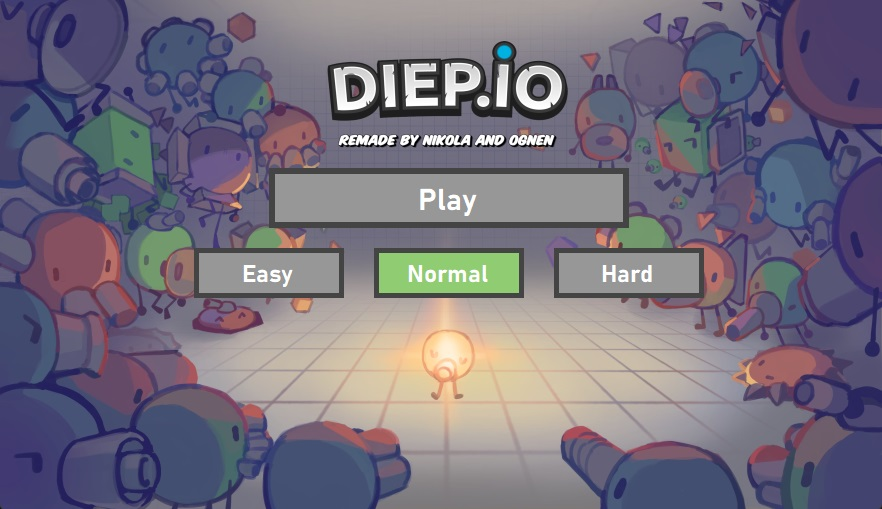
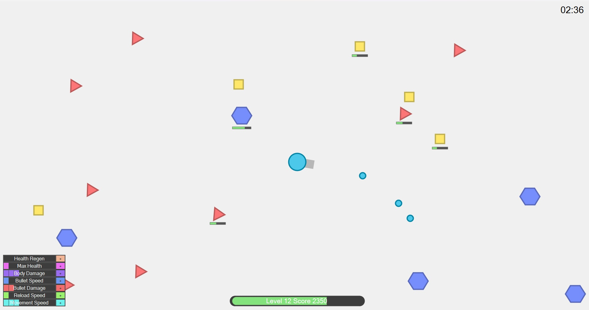
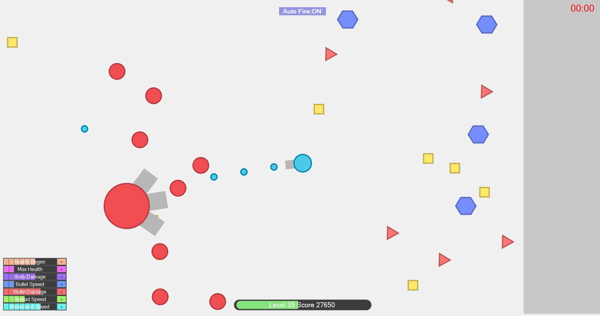

# Tank Shooter Game Documentation

## Overview

Welcome to the Tank Shooter Game documentation! Tank Shooter is a thrilling remake inspired by the classic Diep.io game, built with Windows Forms. Dive into intense battles where you control a powerful tank, shooting down shapes to collect points and face a challenging boss at the end.

## Gameplay

In Tank Shooter, your mission is to navigate the battlefield, strategically shooting down shapes to earn points. As you accumulate points, level up your tank, and unlock powerful upgrades. The ultimate test awaits at the end of each level – a boss fight that will push your skills to the limit.

## Key Features

- **Point Collection:** Shoot and collect points by taking down shapes scattered across the battlefield.

- **Boss Battles:** Prepare for epic showdowns against formidable bosses at the end of each level. Adapt your strategy to conquer these challenging foes.

- **Tank Upgrades:** Customize your tank's abilities, including bullet speed, bullet damage, and max health, to become a force to be reckoned with.

- **Dynamic Levels:** Progress through increasingly challenging levels, each presenting a new set of obstacles and shapes to conquer.

## How to Play

1. **Movement:** Use intuitive controls to maneuver your tank across the battlefield.

2. **Shooting:** Aim at shapes using your mouse and click to shoot. Collect points for each successful hit.

3. **Upgrades:** Level up your tank by collecting points. Unlock and enhance upgrades to strengthen your tank for tougher challenges.

4. **Boss Fights:** Gear up for intense boss battles at the end of each level. Strategize and use your upgraded tank to defeat these powerful adversaries.

## Screenshots

### Menu Screen

### Gameplay

### Boss Fight

